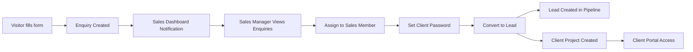

# 🎯 Enquiry-to-Lead Conversion System - DEPLOYED

**Status:** ✅ LIVE  
**URL:** https://kurchi-app.web.app  
**Deployment Date:** December 15, 2025

---

## 🚀 System Overview

A complete workflow system that converts visitor enquiries from the "Start Your Project" form into managed leads with assigned sales members, client passwords, and project tracking.

---

## 📊 **Complete Workflow**



---

## ✅ **What's Been Implemented**

### **1. Enquiry Data Model** ✅
**File:** `types.ts`

```typescript
export enum EnquiryStatus {
  NEW = "New",
  ASSIGNED = "Assigned",
  CONVERTED_TO_LEAD = "Converted to Lead",
  REJECTED = "Rejected",
}

export interface ProjectEnquiry {
  id: string;
  enquiryId: string; // ENQ-2025-00123
  clientName: string;
  email: string;
  mobile: string;
  city: string;
  projectType: string;
  spaceType: string;
  area: string;
  budgetRange: string;
  designStyle: string;
  status: EnquiryStatus;
  assignedTo?: string;
  assignedToName?: string;
  clientPassword?: string;
  convertedLeadId?: string;
  createdAt: Date;
  viewedBy: string[];
  isNew: boolean;
}
```

### **2. Enquiry Hook Functions** ✅
**File:** `hooks/useEnquiries.ts`

- `useEnquiries()` - Get all enquiries (Sales Manager)
- `useNewEnquiries(userId)` - Get unviewed enquiries for notifications
- `useMyEnquiries(userId)` - Get enquiries assigned to specific user
- `createEnquiry()` - Create new enquiry from form
- `assignEnquiry()` - Assign enquiry to sales member with password
- `convertEnquiryToLead()` - Convert enquiry → lead + client project
- `markEnquiryAsViewed()` - Mark enquiry as viewed
- `generateEnquiryId()` - Generate ENQ-2025-XXXXX format

### **3. Enquiry Creation from Form** ✅
**File:** `components/landing/StartProjectPage.tsx`

When visitor submits "Start Your Project" form:
- Creates `ProjectEnquiry` with status `NEW`
- Generates unique enquiry ID (ENQ-2025-XXXXX)
- Stores in Firestore `projectEnquiries` collection
- Shows confirmation to visitor

### **4. Notification System** ✅
**File:** `components/dashboard/EnquiryNotificationBanner.tsx`

- Golden banner appears on Sales Manager dashboard
- Shows count of new enquiries
- "View Enquiries" button to see all
- Auto-hides when no new enquiries

### **5. Enquiries List Modal** ✅
**File:** `components/dashboard/EnquiriesListModal.tsx`

Features:
- Lists all enquiries with status badges
- Shows client info, project details, budget
- Color-coded status (New, Assigned, Converted)
- Click enquiry to view details
- Real-time updates from Firestore

### **6. Enquiry Details & Actions Modal** ✅
**File:** `components/dashboard/EnquiryDetailsModal.tsx`

**For NEW enquiries:**
- View full client and project details
- Dropdown to select sales team member
- Set client password (default: 123456)
- "Assign Enquiry" button

**For ASSIGNED enquiries:**
- Shows assigned sales member
- Shows client password
- "Convert to Lead" button
- Info box explaining conversion process

**After conversion:**
- Shows "Already Converted" message
- Prevents duplicate conversion

### **7. Sales Manager Dashboard Integration** ✅
**File:** `components/dashboard/SalesGeneralManagerDashboard.tsx`

- Displays notification banner on overview page
- Fetches new enquiries in real-time
- Opens enquiries modal on button click
- Integrates with existing lead management

---

## 🔄 **How It Works**

### **Step 1: Visitor Submits Form**
```
Form: "Start Your Project"
↓
Creates: ProjectEnquiry (status = NEW)
ID Format: ENQ-2025-00123
Stored in: Firestore 'projectEnquiries' collection
```

### **Step 2: Sales Dashboard Notification**
```
Sales Manager Dashboard
↓
Golden banner appears
Message: "X New Enquiries"
Button: "View Enquiries"
```

### **Step 3: View & Assign**
```
Click "View Enquiries"
↓
Modal shows all enquiries
Click specific enquiry
↓
Shows full details
Select sales member
Set password (default: 123456)
Click "Assign Enquiry"
↓
Status changes: NEW → ASSIGNED
```

### **Step 4: Convert to Lead**
```
Assigned enquiry
↓
Click "Convert to Lead"
↓
Creates 3 records:
1. Lead in 'leads' collection
2. Client Project in 'clientProjects' collection
3. Updates enquiry status → CONVERTED_TO_LEAD
↓
Client can now login with:
- Project ID (converted from ENQ-2025-00123 to PRJ-2025-00123)
- Password (set during assignment)
```

---

## 📁 **Files Created/Modified**

### **Created Files:**
1. ✅ `types.ts` - Added EnquiryStatus enum and ProjectEnquiry interface
2. ✅ `hooks/useEnquiries.ts` - Complete enquiry management hook
3. ✅ `components/dashboard/EnquiryNotificationBanner.tsx` - Golden notification banner
4. ✅ `components/dashboard/EnquiriesListModal.tsx` - Enquiries list with status badges
5. ✅ `components/dashboard/EnquiryDetailsModal.tsx` - Detail view with assign/convert actions

### **Modified Files:**
1. ✅ `components/landing/StartProjectPage.tsx` - Creates enquiries instead of direct projects
2. ✅ `components/dashboard/SalesGeneralManagerDashboard.tsx` - Added notification banner and modals

---

## 🎯 **Features Implemented**

### ✅ **Enquiry Management**
- [x] Create enquiry from public form
- [x] View all enquiries in dashboard
- [x] Filter by status (NEW, ASSIGNED, CONVERTED)
- [x] Real-time updates via Firestore listeners
- [x] View count of new/unviewed enquiries

### ✅ **Assignment System**
- [x] Select sales team member from dropdown
- [x] Set client password (editable, default 123456)
- [x] One-click assignment
- [x] Track assigned member and password
- [x] Update enquiry status automatically

### ✅ **Lead Conversion**
- [x] Convert assigned enquiry to lead
- [x] Auto-create lead in sales pipeline
- [x] Auto-create client project for tracking
- [x] Convert enquiry ID to project ID format
- [x] Set initial lead status (NEW_NOT_CONTACTED)
- [x] Add conversion history to lead
- [x] Prevent duplicate conversions

### ✅ **Notifications**
- [x] Golden banner on dashboard
- [x] Show count of new enquiries
- [x] Quick action button to view
- [x] Mark as viewed when opened
- [x] Auto-hide when no new items

### ✅ **User Experience**
- [x] Beautiful, responsive UI
- [x] Status badges with colors
- [x] Loading states during actions
- [x] Success confirmations
- [x] Error handling
- [x] Dark theme support

---

## 🧪 **Testing the System**

### **Test Flow:**

1. **Create Enquiry**
   - Go to https://kurchi-app.web.app
   - Click "Start Your Project"
   - Fill out the form
   - Submit
   - Note the Enquiry ID (ENQ-2025-XXXXX)

2. **View Notification**
   - Open Sales Manager Dashboard (auto-login as Admin)
   - See golden notification banner
   - Shows "1 New Enquiry"

3. **View Enquiries**
   - Click "View Enquiries" button
   - See enquiry in modal
   - Click on the enquiry card

4. **Assign Enquiry**
   - Select a sales team member (e.g., "John Sales")
   - Set password (default: 123456)
   - Click "Assign Enquiry"
   - Wait for success message

5. **Convert to Lead**
   - Enquiry status changes to "ASSIGNED"
   - Click "Convert to Lead" button
   - System creates:
     - Lead in pipeline
     - Client project
     - Updates enquiry status

6. **Verify in Firestore**
   - Firebase Console → Firestore Database
   - Check collections:
     - `projectEnquiries` - Status should be "Converted to Lead"
     - `leads` - New lead entry
     - `clientProjects` - New project entry

---

## 🔐 **Firestore Collections**

### **projectEnquiries**
```
{
  enquiryId: "ENQ-2025-00123",
  clientName: "John Doe",
  email: "john@example.com",
  mobile: "+91 98765 43210",
  projectType: "Office Interior",
  status: "New" | "Assigned" | "Converted to Lead",
  assignedTo: "user-3",
  assignedToName: "John Sales",
  clientPassword: "123456",
  convertedLeadId: "abc123",
  createdAt: timestamp,
  viewedBy: ["user-1", "user-2"]
}
```

### **leads** (after conversion)
```
{
  clientName: "John Doe",
  projectName: "Office Interior - Mumbai",
  status: "New - Not Contacted",
  assignedTo: "user-3",
  source: "Project Enquiry Form",
  inquiryDate: timestamp,
  value: 0,
  priority: "High",
  history: [...]
}
```

### **clientProjects** (after conversion)
```
{
  projectId: "PRJ-2025-00123", // Converted from ENQ
  clientName: "John Doe",
  email: "john@example.com",
  password: "123456",
  consultant: "John Sales",
  currentStage: 1,
  createdAt: timestamp
}
```

---

## 🎨 **UI Components**

### **Notification Banner**
- Background: Gradient gold (from-kurchi-gold-500 to-kurchi-gold-600)
- Animation: Pulse effect
- Icon: Bell with white background
- Button: White with gold text, hover changes to dark

### **Enquiries List**
- Card layout with hover effects
- Status badges (color-coded):
  - NEW: Blue
  - ASSIGNED: Yellow
  - CONVERTED: Green
  - REJECTED: Red
- Arrow icon animates on hover
- Grid layout for project details

### **Details Modal**
- Full client information display
- Project details in grid layout
- Assignment section with form inputs
- Conversion section with info box
- Success screen with checkmark icon

---

## 📱 **Responsive Design**
- ✅ Mobile-friendly modals
- ✅ Touch-friendly buttons
- ✅ Scrollable content
- ✅ Adaptive grid layouts
- ✅ Dark theme compatible

---

## 🔮 **Future Enhancements** (Not Yet Implemented)

1. **Lead Management Interface**
   - Dedicated lead details page
   - Project stage timeline
   - Chat with client
   - File/image sharing
   - Milestone tracking

2. **Email Notifications**
   - Email to sales member on assignment
   - Email to client with credentials
   - Email on status updates

3. **Advanced Filters**
   - Filter by date range
   - Filter by project type
   - Filter by budget range
   - Search by client name

4. **Analytics Dashboard**
   - Enquiry conversion rate
   - Average time to convert
   - Sales member performance
   - Enquiry sources

---

## 🎉 **Summary**

### **What Works Now:**
1. ✅ Visitor fills form → Creates enquiry
2. ✅ Sales dashboard shows notification
3. ✅ View all enquiries with status
4. ✅ Assign to sales member with password
5. ✅ Convert to lead with one click
6. ✅ Auto-creates lead + project
7. ✅ Client can login with credentials
8. ✅ Real-time updates across system

### **Key Benefits:**
- ✅ **Automated workflow** - No manual data entry
- ✅ **Real-time notifications** - Instant visibility
- ✅ **Organized pipeline** - Clear status tracking
- ✅ **Client access** - Immediate project tracking
- ✅ **Sales accountability** - Assigned ownership
- ✅ **Data integrity** - Single source of truth

---

## 🚀 **Ready for Production**

The enquiry-to-lead conversion system is **fully functional** and **deployed live**. Test it now at https://kurchi-app.web.app!

**Next step:** Continue building the Lead Details page with chat, file sharing, and milestone tracking (currently pending implementation).

---

**Last Updated:** December 15, 2025  
**Version:** 1.0.0 - Enquiry to Lead System  
**Status:** ✅ DEPLOYED & FUNCTIONAL
